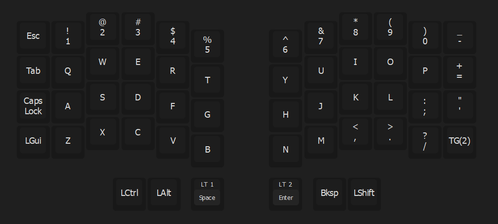

# Silakka54 – VIAL Keymap Config

Custom keymap configuration for the **Silakka54** split keyboard using VIAL.  
Designed for daily use, coding, and general productivity.

---

## Layers

### Layer 0 – Base
- QWERTY-style alphas.
- Modifiers and number row with symbols.

---

### Layer 1 – Symbols & Functions
- Function row (F1–F12).
- Extended symbol access.

---

### Layer 2 – Navigation
- Arrow keys.
- Minimal movement layout.

---

## Notes

- Optimized for split ergonomic use with minimal hand travel.
- Layer toggles are designed for fast access.
- Built for flexibility — layout will evolve as needs change.
- I’ll continue refining this as I hit limitations or get new ideas.

---

## How to Use

1. Open the **VIAL** application.
2. Go to `File > Load saved layout...`
3. Select the **silakka54.vil** file from this repo.